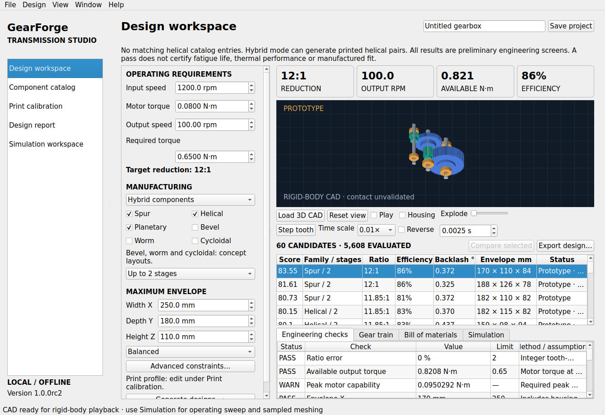
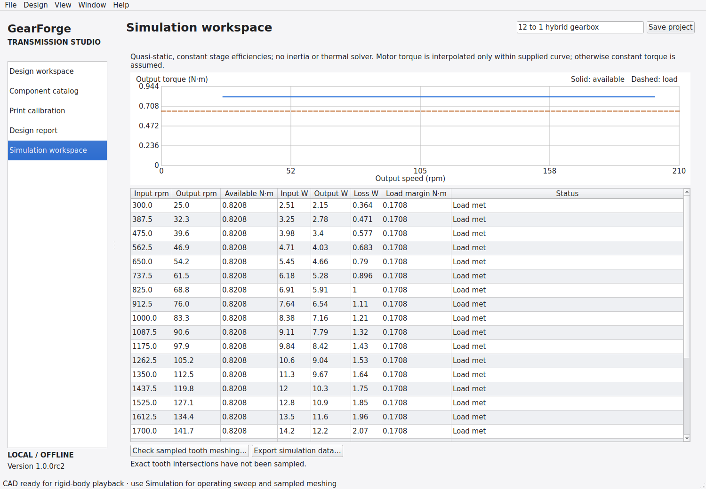

# GearForge Studio

**Generate, compare, simulate and export gearbox prototypes from operating requirements.**

GearForge Studio is an offline desktop application for exploring gearboxes made
with 3D printed parts, catalog gears, or combinations of both. It combines a
native Qt workspace, discrete design search, engineering screening, a component
catalog, dimensional print calibration, rigid-body CAD animation and design exports.

**Current version: 1.0.0rc2 · Python 3.12 recommended · Apache-2.0 application code**

> **Release status:** This is a tested software release candidate for prototype
> engineering. Its calculations are preliminary screens, not certified ISO/AGMA
> gearbox ratings. Spur, helical and planetary tooth CAD is available; bevel,
> worm and cycloidal designs remain concepts. Physical load/life validation,
> native Windows/macOS checks and signed distribution are still outstanding.
> See [release status](docs/RELEASE_STATUS.md) for the complete boundary.



## Contents

- [Features](#features)
- [Supported designs and manufacturing modes](#supported-designs-and-manufacturing-modes)
- [Requirements and platform status](#requirements-and-platform-status)
- [Install and launch](#install-and-launch)
- [Design your first gearbox](#design-your-first-gearbox)
- [Simulation workspace](#simulation-workspace)
- [Component catalogs](#component-catalogs)
- [Print calibration](#print-calibration)
- [Exported files](#exported-files)
- [Command-line interface](#command-line-interface)
- [Projects, local data and privacy](#projects-local-data-and-privacy)
- [Engineering methods and limitations](#engineering-methods-and-limitations)
- [Development and testing](#development-and-testing)
- [Build packages and GitHub releases](#build-packages-and-github-releases)
- [Upload this project to GitHub](#upload-this-project-to-github)
- [Troubleshooting](#troubleshooting)
- [Repository guide](#repository-guide)
- [Contributing and licensing](#contributing-and-licensing)

## Features

- **Requirement-driven synthesis:** Enter speeds, torque, size limits, stage
  count, manufacturing mode and design priorities; compare feasible alternatives.
- **Engineering screens:** Review ratio error, available torque, backlash,
  printable tooth dimensions, contact ratio, tooth bending, shaft stress/deflection
  and generic bearing capacity/life estimates with their assumptions.
- **Catalog components:** Use source-traceable seed records or import a validated
  CSV catalog. Unknown prices stay unknown; supplier conditions remain visible.
- **Native desktop workspace:** Platform controls and system fonts, appearance
  and text-size preferences, resizable sidebar, keyboard shortcuts, accessible
  field names, autosave, project recovery and cancellable background jobs.
- **CAD and kinematics:** Orbit, zoom, show the housing, explode the assembly,
  play/pause, reverse, seek and step one input tooth while preserving the CAD model.
- **Motor/load exploration:** Inspect output torque versus speed, load margin,
  assumed power loss and overload, and optionally sample exact tooth intersections.
- **Manufacturing references:** Export STEP, STL/3MF, reports, a bill of materials,
  SVG layouts, assembly notes, source project and file checksums.
- **Offline batch operation:** Run searches, diagnostics and exports from a CLI.

The search is a bounded discrete exploration of the implemented templates. It
returns a ranked shortlist with Pareto flags; it does not prove global optimality.

## Supported designs and manufacturing modes

| Family | Implemented search | Detailed CAD | Current scope |
| --- | --- | --- | --- |
| Spur | One or two stages; printed, catalog or mixed gears | Sampled involute teeth | Prototype |
| Helical | One or two stages; opposite helix hands | Twisted sampled involute teeth | Prototype |
| Planetary | Fixed ring, sun input, three planets, carrier output | External/internal sampled involutes and carrier | Prototype |
| Bevel | Single-stage ratio and packaging concepts | No manufacturing tooth solids | Concept |
| Worm | Starts/wheel ratios and assumed efficiency | No manufacturing tooth solids | Concept |
| Cycloidal | Integer reduction and packaging concepts | No manufacturing contact geometry | Concept |

| Manufacturing mode | Gears | Housing | Other hardware |
| --- | --- | --- | --- |
| Printed | Parametric printed gears | Printed | Purchased/machined steel shafts, bearings and fasteners |
| Commercial | Compatible catalog entries, with their recorded bores | Machined | Purchased/machined hardware |
| Hybrid | Printed and catalog combinations | Printed | Purchased/machined hardware |

Commercial mode uses catalog gears in a custom assembly; it does not select a
complete stocked gearbox. Catalog geometry is a dimensional reference, not
manufacturer production CAD. Plain-bore gears require a reviewed torque-transfer
attachment; the app does not silently assume a reboring operation.

Concept designs can be compared and exported as reports/layouts. Their detailed
manufacturing solids and tooth-intersection checks are unavailable.

The current search supports reductions greater than 1:1 and up to 100:1,
modules from 0.8 to 3.0 mm, and at most two external-gear stages. Imported catalog
records can cover wider dimensional ranges than this search currently uses.

## Requirements and platform status

Use **64-bit Python 3.11–3.13**. Python **3.12** is the locally tested build runtime.
A graphical desktop is required for normal GUI use. Installation downloads
Python dependencies; synthesis, preview, simulation and exports run locally.

Core packages are PySide6 Essentials, CadQuery/Open CASCADE and ReportLab.
`constraints-release.txt` pins the tested core/build package versions; it is a
constraints file, not a complete dependency lock for every platform.

| Target | Current evidence |
| --- | --- |
| Linux x86_64 | Source and frozen executable checked with Qt offscreen; search, CAD preview and simulation workspace passed |
| Linux portable bundle | Built on glibc 2.39; targets Ubuntu 24.04-class systems with glibc 2.39 or newer |
| Interactive Linux desktop | Requires X11/Wayland display libraries; no interactive display was available for the recorded checks |
| Windows | Native build/test workflow configured; no native Windows result is claimed |
| macOS | macOS 14 build target, `.app` metadata and document integration configured; native/Finder/VoiceOver validation pending |

The native assets are unsigned. The macOS runner builds its own architecture,
not a universal Intel/Apple Silicon application.

## Install and launch

Clone this repository (or extract the source ZIP), then run the installation
commands from the directory containing `pyproject.toml` and this README:

```bash
git clone https://github.com/jonahsaunders/Gearforge-Studio.git
cd Gearforge-Studio
```

### Linux and macOS

```bash
python3 -m venv .venv
.venv/bin/python -m pip install -c constraints-release.txt .
.venv/bin/python -m gearforge doctor
.venv/bin/python -m gearforge gui
```

### Windows PowerShell

The following uses the recommended Python 3.12 installation:

```powershell
py -3.12 -m venv .venv
.\.venv\Scripts\python.exe -m pip install -c constraints-release.txt .
.\.venv\Scripts\python.exe -m gearforge doctor
.\.venv\Scripts\python.exe -m gearforge gui
```

No shell activation is required when using these explicit interpreter paths.
After installation, `gearforge-studio` is the GUI entry point and `gearforge`
is the console entry point in the environment's `bin` or `Scripts` directory.

### Generated release packages

A **source release kit** produced by `scripts/build_release.py` contains a wheel,
`VERSION.txt` and top-level `Install-and-launch.sh`, `.command` and `.bat` launchers.
Their first run installs dependencies into a version-specific environment.
The files under `packaging/` are launcher templates used when creating that kit.

A **Linux native archive** contains the executable and its `_internal` dependency
folder. Extract the whole archive, keep those files together and run
`./GearForgeStudio`. Read its `START_HERE.txt` and the platform notes in
[packaging/LINUX_README.txt](packaging/LINUX_README.txt).

## Design your first gearbox

1. Launch the app and open [the 12:1 hybrid example](examples/12-to-1-hybrid.gearforge)
   through **File → Open project**.
2. Review input speed, available motor torque, desired output speed and required
   output torque. Values use rpm, N·m and millimetres.
3. Select the manufacturing mode, families, maximum stage count and envelope.
   Use **Advanced constraints** for peak/safety factors, bearing life, ratio
   tolerance, motor curve, module limits, shaft sizes and supplier filtering.
4. Choose a ranking priority and select **Generate designs**.
5. Select a candidate. Review its engineering checks, stage data, bill of
   materials and assumptions. `PASS` means a modeled screen passed under those
   assumptions; `WARN` identifies an unverified condition.
6. Select **Load 3D CAD** for a prototype family. Inspect tooth geometry, shafts,
   carrier where applicable, housing and exploded arrangement.
7. Open **Simulation workspace** for the operating sweep and optional sampled
   tooth check. See the methods and limits below.
8. Compare multiple rows using Ctrl/Cmd or Shift selection, calibrate dimensional
   print compensation if needed, then export to a new directory.

The default example targets **1200 rpm input, 100 rpm output, 0.08 N·m motor
torque and 0.65 N·m required output**. Your resulting shortlist depends on the
project constraints and current catalog. Loading a saved project requires a new
search against the current catalog before CAD/export.

Examples also cover [helical](examples/helical-example.gearforge),
[planetary](examples/planetary-example.gearforge),
[commercial gears](examples/commercial-example.gearforge),
[bevel](examples/bevel-example.gearforge), [worm](examples/worm-example.gearforge)
and [cycloidal concepts](examples/cycloidal-example.gearforge).

## Simulation workspace



### Rigid-body playback

Playback integrates measured elapsed time and input RPM rather than advancing a
fixed angle per rendered frame. External gear pairs counterrotate; compound
shafts use accumulated stage ratios. The planetary configuration uses the Willis
relation for a fixed ring, sun input and carrier output, with planet spin and orbit.

| Control | Behavior |
| --- | --- |
| Play / pause | Start explicitly; retain the current pose when paused |
| Time scale | `.001×`, `.01×`, `.1×` or `1×` simulated seconds per wall-clock second |
| Reverse | Reverse the input direction |
| Time field | Seek using the current speed from time zero |
| Step tooth | Advance one input-tooth pitch while paused |
| Arrow keys / drag | Orbit the CAD view |
| `+` / `−` / scroll | Zoom the CAD view |
| `R` / Space | Reset view / toggle playback when the viewer has focus |
| Reduce motion | Disable continuous play while retaining seek and stepping |

Playback scale changes display time, not the operating RPM used in the design.
Bearings are stationary reference rings; rolling elements are not simulated.

### Motor/load and power sweep

With a supplied motor curve, torque is interpolated only within its recorded
speed range. The curve format is `[[rpm, torque_Nm], ...]`, with distinct speed
samples. Without a curve, the sweep assumes constant motor torque from 0.25 to
2 times design input speed, bounded by the supported speed limits.

For ratio `R`, assumed total efficiency `eta` and motor torque `T`:

- Available output torque: `T_out = T × R × eta`.
- Input power: `P_in = T × rpm × 2π / 60`.
- Output power: `P_out = eta × P_in`; modeled loss: `P_in − P_out`.
- Load margin: available output torque minus the requested output load.

Displayed powers describe full modeled motor capability at the prescribed speed.
They are not a partial-load power-consumption prediction. An overload flag marks
an unsustainable prescribed operating point under this model; it does not solve
stall or deceleration. Off-design sweep points do not rerun every stress,
bearing or temperature screen.

### Sampled tooth intersections

The optional cancellable background check builds real B-rep tooth solids and
checks mating gear pairs at **12 discrete poses over one input revolution**.
Its JSON evidence includes phases, pair overlap volumes and a 0.05 mm³ reporting
threshold. A passing sample check does not cover continuous contact, unsampled
interference or a complete assembly repeat cycle.

These are rigid kinematic and quasi-static models. They do not solve inertia,
impact, elastic contact pressure, lubrication, wear, fatigue, temperature or
planetary load sharing. See [simulation methods](docs/SIMULATION.md) and the
[recorded example evidence](docs/mesh-sampling-evidence.json).

## Component catalogs

The seed catalog includes **six KHK gear records** with dimensional/rating facts,
source URLs and retrieval dates. Price and stock are not fabricated. The generic
bearing table provides screening references rather than supplier-verified ratings.

In **Component catalog**, export a CSV/template, edit compatible records and
import it. The exact ordered columns are:

```text
sku,supplier,family,module_mm,teeth,pressure_deg,helix_deg,width_mm,bore_mm,hub_diameter_mm,hub_width_mm,material,bending_nm,contact_nm,price,currency,source_url,rating_conditions,retrieved_date
```

Preserve column order, use HTTPS source URLs, unique SKUs and finite values in
supported ranges. Leave unknown prices blank. Imports validate all rows before
updating SQLite; an invalid row rejects the transaction. Catalog changes require
regenerating previous designs. Double-click a record to open its supplier source.

Supplier bending/contact ratings are conditional on mating gears, speed,
lubrication, life and other stated conditions. A comparison with those values is
not a certified rating for your application.

## Print calibration

In **Print calibration**, save a material profile, export the dimensional coupon,
measure its outside size and bore, and apply the measured compensation. Reprint
the coupon to verify the correction. Profiles include backlash, bore and bearing
clearance, shrink compensation, print orientation and recorded test evidence.

A dimensional coupon establishes dimensional compensation only. It does not
measure allowable strength, fatigue, creep or wear. Initial material allowables
are illustrative inputs and need independent characterization for the intended
printer, orientation, temperature, batch and duty.

## Exported files

Exports publish a new directory atomically and refuse to overwrite an existing
one. Use report-only export when reviewing a concept or a geometry issue.

| File or folder | Purpose |
| --- | --- |
| `assembly.step` / `step/` | Nominal assembly and individual-part CAD for prototype families |
| `print/` | Print-local STL/3MF for printed parts, with optional shrink compensation |
| `bom.csv` | Quantities, component sources and known/unknown quotations |
| `report.html` / `report.pdf` | Calculations, assumptions, checks and limitations |
| `layout.svg` / `shafts.svg` | Reference layout and shaft schedule |
| `cad-interference.json` | Static solid-intersection results when CAD is exported |
| `simulation-sweep.json` / `.csv` | Quasi-static operating sweep and power/load data |
| `design.gearforge` | Requirements, profile and selected design snapshot |
| `ASSEMBLY.txt` | Prototype assembly and inspection notes |
| `manifest.json` | File SHA-256 hashes, app version and candidate identity |

The Simulation workspace can also export sweep data with a completed sampled
mesh check. Unexpected static interference blocks CAD export. SVG references
are not production drawings with certified fits, surface finishes or GD&T.

## Command-line interface

Use the installed `gearforge` executable, or `python -m gearforge` with the
appropriate environment interpreter:

```bash
gearforge --version
gearforge doctor
gearforge new example.gearforge
gearforge search example.gearforge --out candidates.json --limit 60
gearforge export example.gearforge --out design-export
gearforge export example.gearforge --out report-export --report-only
gearforge smoke --out desktop-diagnostics --cad
```

`search` and `export` accept `--catalog custom.csv`. Export recalculates the
shortlist. Use `--candidate ID` to select an ID from a search using the same
project/catalog and a sufficient `--limit`; the default exports the highest-ranked
candidate. Existing project/search-output/export paths are preserved.

The smoke command writes screenshots and diagnostic JSON into a new folder.
To run it on a headless host, use `QT_QPA_PLATFORM=offscreen`. Normal desktop
launches require a display and should not use that variable.

## Projects, local data and privacy

Projects are versioned, size-limited `.gearforge` JSON documents, not executable
scripts. Catalogs and saved print profiles are stored in local SQLite. Settings,
rotating logs and autosave recovery are kept in the platform's Qt app-data location.
Set `GEARFORGE_DATA_DIR` to a writable directory to choose a different location.

Modified projects are autosaved every 30 seconds. Restore through
**File → Restore autosave**. Project/profile changes require regeneration before
CAD/export; stale background preview/check results are not applied to new inputs.

The app has no telemetry, automatic purchasing, license-server connection or
supplier scraping. Supplier pages open only through a user's catalog action.
Dependency installation and GitHub Actions builds require network access.

## Engineering methods and limitations

The engine screens reduction and envelope constraints, available continuous
output torque, accumulated backlash, pitch velocity, external contact ratio,
printable dimensions, Lewis tooth bending, combined shaft bending/torsion and
deflection, and generic bearing static/speed/L10 estimates. Requested safety and
peak factors enter structural screens; continuous torque does not establish
motor peak-load capability.

Gear roots use sampled radial relief rather than a generated cutter trochoid.
Stage efficiencies, dynamic factors and material/bearing allowables are screening
assumptions. Housing, carrier, pins, retention, external shaft loads, manufactured
fits, polymer aging/creep and service wear/life remain unverified.

Establish a production design using reviewed supplier conditions, tolerances,
retention and lubrication, independent reference calculations and physical
gearbox tests. See [release status](docs/RELEASE_STATUS.md) and
[architecture and load assumptions](docs/ARCHITECTURE.md).

## Development and testing

Install the development dependencies using the tested constraints:

```bash
python -m pip install -c constraints-release.txt '.[dev]'
python scripts/check_version.py
python -m pytest -q
```

For a headless Linux/macOS test run:

```bash
QT_QPA_PLATFORM=offscreen python -m pytest -q --junitxml=build/test-results.xml
```

For PowerShell:

```powershell
$env:QT_QPA_PLATFORM = 'offscreen'
python -m pytest -q --junitxml=build/test-results.xml
Remove-Item Env:QT_QPA_PLATFORM
```

The recorded rc2 full suite passed **48 tests**, with an additional final GUI pass.
Coverage includes numerical constraints, catalogs/projects, CLI/worker flows,
real CAD solids/interference/STEP round-trips, export manifests, timed motion,
planetary relations, power balance, stale results and reduced-motion behavior.
A deliberately misaligned gear phase is a negative control for collision detection.
See [VALIDATION.json](VALIDATION.json) for exact evidence and untested targets.

These local results do not imply that the included remote CI workflows have run
or that physical gearbox load/life has been validated.

## Build packages and GitHub releases

Build on the target operating system with development dependencies installed:

```bash
python -m build
python scripts/collect_licenses.py
python -m PyInstaller packaging/gearforge.spec --noconfirm
python scripts/native_archive.py --smoke
python scripts/build_release.py
```

To produce the clean repository ZIP for uploading source code, run
`python scripts/package_github.py`. It places the archive under `release-assets/`
with `README.md` at its root and includes a per-file SHA-256 list.

The result includes wheel/source distributions, target-native archives,
checksums and a source release kit. Keep dependency notices with native bundles.
The macOS spec generates an `.app` with project document metadata; Windows uses a
windowed executable and a file-based worker protocol.

| Workflow | Trigger | Result |
| --- | --- | --- |
| `.github/workflows/ci.yml` | Pull requests, pushes to `main`, manual run | Python 3.12 tests on Linux, Windows and macOS |
| `.github/workflows/release.yml` | `v*` tags or manual run | Tests, native builds, frozen smoke checks, archives and checksums |
| Release draft job | Matching tag after all native builds succeed | Creates a draft prerelease with assets and release notes |

For the current release:

```bash
git tag -a v1.0.0rc2 -m "GearForge Studio 1.0.0rc2"
git push origin v1.0.0rc2
```

The tag must match package/runtime versions. Manual builds on `main` upload
workflow artifacts without creating a release draft. The separate numeric
macOS build in `pyproject.toml` must increase for each distributed Mac build.

Review platform results, manually launch on each target, and complete signing,
macOS notarization and the accessibility/platform checks before publication.
The workflow does not automatically publish its draft. Full instructions are in
[GitHub release preparation](docs/GITHUB_RELEASE.md).

## Upload this project to GitHub

The GitHub source ZIP is a repository package. **Extract it first**, then upload
its files and directories into the repository root so `README.md`,
`pyproject.toml`, `src/` and `.github/` retain their relative positions.
Uploading the ZIP alone stores an archive rather than populating the repository.

Using GitHub's web interface, create a repository, choose **Add file → Upload
files**, add the extracted contents and commit them. Include `.github/` and
`.gitignore`, which may be hidden by your file manager. The Git method below
includes them automatically and preserves file permissions:

```bash
git init -b main
git add .
git commit -m "Add GearForge Studio 1.0.0rc2"
git remote add origin https://github.com/jonahsaunders/Gearforge-Studio.git
git push -u origin main
```

Replace the example remote with your own empty repository and use your configured
Git author identity. If you already created repository files on GitHub, clone
that repository and copy the extracted source into it before committing.
Native binaries, generated CAD, databases and build output are excluded from this
source archive. Add distributable binaries as GitHub release assets.

See [GitHub's upload instructions](https://docs.github.com/en/repositories/working-with-files/managing-files/adding-a-file-to-a-repository)
and the [release guide](docs/GITHUB_RELEASE.md).

## Troubleshooting

| Symptom | What to check |
| --- | --- |
| Installation cannot find compatible wheels | Use 64-bit Python 3.12 in a fresh environment; check the platform and core version constraints |
| GUI cannot start on Linux | Run from a graphical session; inspect Qt display-library errors. The recorded host lacked `libxcb-cursor.so.0`, commonly supplied by `libxcb-cursor0` |
| GUI is invisible after tests | Remove `QT_QPA_PLATFORM=offscreen` from the normal launch environment |
| No feasible candidates | Review rejection explanations; check ratio, envelope, torque, module, backlash, mode and catalog constraints |
| CAD/export requests regeneration | Requirements, profile or catalog changed; generate a new shortlist |
| Detailed CAD unavailable | Bevel, worm and cycloidal entries are concept-only in rc2 |
| CAD export reports interference | Export report-only, inspect geometry/fit assumptions and sample tooth poses; a static pass alone is insufficient |
| CSV import rejected | Start with the exported template, preserve exact column order and inspect the reported row |
| Job cannot start | Check the installed environment and writable app-data directory; inspect the local log or run CLI diagnostics |
| Export path already exists | Choose a new output directory; existing exports are not overwritten |

## Repository guide

| Path | Contents |
| --- | --- |
| `src/gearforge/` | Desktop UI, search engine, models, CAD, simulation, export and CLI code |
| `src/gearforge/data/` | Source-traceable seed catalog and application icon |
| `tests/` | Numerical, data, CAD, GUI, worker and release regression tests |
| `examples/` | Editable `.gearforge` examples for supported families/modes |
| `screenshots/` | Design and simulation workspace previews |
| `docs/` | Architecture, simulation methods, GUI audit and release instructions |
| `packaging/` | Native build spec, launcher templates and supplemental license texts |
| `scripts/` | Version checks, license collection, package/archive creation |
| `.github/` | Test/release workflows and contribution templates |
| `VALIDATION.json` | Recorded test/platform evidence and outstanding validation |

## Contributing and licensing

See [CONTRIBUTING.md](CONTRIBUTING.md) for the development workflow and
[SECURITY.md](SECURITY.md) for vulnerability reporting. Include a minimal project,
version, platform, reproduction steps and sanitized evidence when reporting a bug.

GearForge application code is licensed under [Apache-2.0](LICENSE). Third-party
packages retain their own licenses. Read [THIRD_PARTY_NOTICES.md](THIRD_PARTY_NOTICES.md)
and the notices collected for the exact native build before redistribution.
No commercial Qt license, mechanical certification or commercial support contract
is supplied by this source repository.
