# Screenshot gallery

[Back to the overview](../README.md) · [User guide](USER_GUIDE.md)

These are unmodified captures of **GearForge Studio 1.0.0rc12**, running on Windows with Qt’s offscreen platform, light appearance and Segoe UI. All views use the repository’s example files. Native controls and fonts vary by platform. Click an image to inspect it at full resolution.

The fixed material-point view shows the current development addition documented in the changelog. Its separate capture record is [captures-probes.json](../screenshots/captures-probes.json).

**Example scope:** Synthetic inputs demonstrate calculations; they are not measured material, manufacturing or component allowables. The app does not provide qualified production gearbox ratings.

- [Design workspace](#design-workspace)
- [Exploded assembly](#exploded-assembly)
- [Helical prototype](#helical-prototype)
- [Planetary prototype](#planetary-prototype)
- [Motor and load simulation](#motor-and-load-simulation)
- [Component catalog](#component-catalog)
- [Print calibration](#print-calibration)
- [Design report](#design-report)
- [Geometry and operating duty](#geometry-and-operating-duty)
- [Shaft loads and motion](#shaft-loads-and-motion)
- [Bearing duty and capacity](#bearing-duty-and-capacity)
- [Shaft material and fatigue](#shaft-material-and-fatigue)
- [Tooth contact and surface fatigue](#tooth-contact-and-surface-fatigue)
- [Thermal network](#thermal-network)
- [Rack-generated tooth profile](#rack-generated-tooth-profile)
- [Elastic tooth-root stress](#elastic-tooth-root-stress)
- [Fixed material-point stresses](#fixed-material-point-stresses)
- [Signed stress history](#signed-stress-history)
- [Rainflow cycle distribution](#rainflow-cycle-distribution)

## Design workspace

Generate and compare a ranked shortlist, inspect modeled checks, and load the selected CAD assembly.

[Open example](../examples/12-to-1-hybrid.gearforge) · [Read the guide](USER_GUIDE.md#design-your-first-gearbox)

## Exploded assembly

Separate gears, shafts and hardware in the rigid-body CAD view.

[Open example](../examples/12-to-1-hybrid.gearforge) · [Read the guide](USER_GUIDE.md#rigid-body-playback)

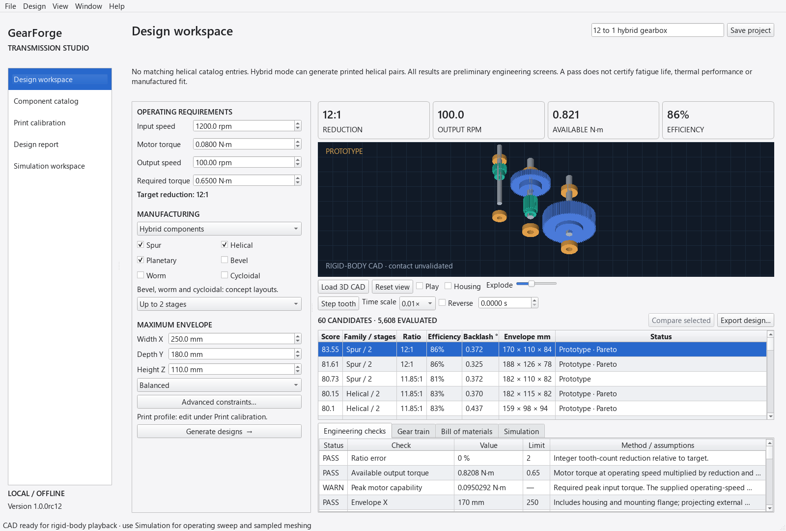

## Helical prototype

Inspect sampled involute teeth with opposite helix hands.

[Open example](../examples/helical-example.gearforge) · [Read the guide](USER_GUIDE.md#design-your-first-gearbox)

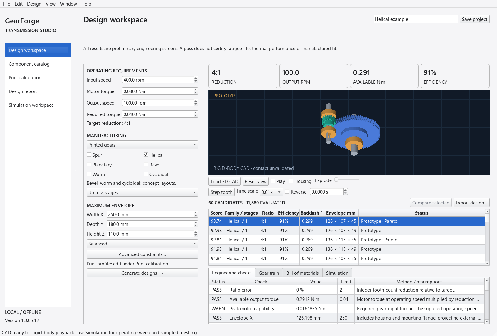

## Planetary prototype

Explore a fixed ring, sun input, three planets and carrier output.

[Open example](../examples/planetary-example.gearforge) · [Read the guide](SIMULATION.md)

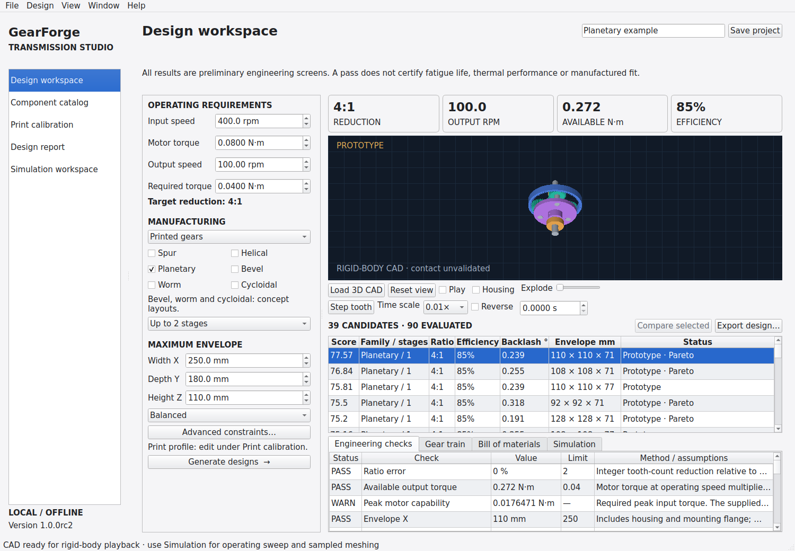

## Motor and load simulation

Review output torque versus speed, requested load, assumed power loss and operating-point tables.

[Open example](../examples/12-to-1-hybrid.gearforge) · [Read the guide](SIMULATION.md)

## Component catalog

Inspect supplier dimensions, recorded rating conditions and source links; import or export validated CSV records.

[Open example](../examples/12-to-1-hybrid.gearforge) · [Read the guide](USER_GUIDE.md#component-catalogs)

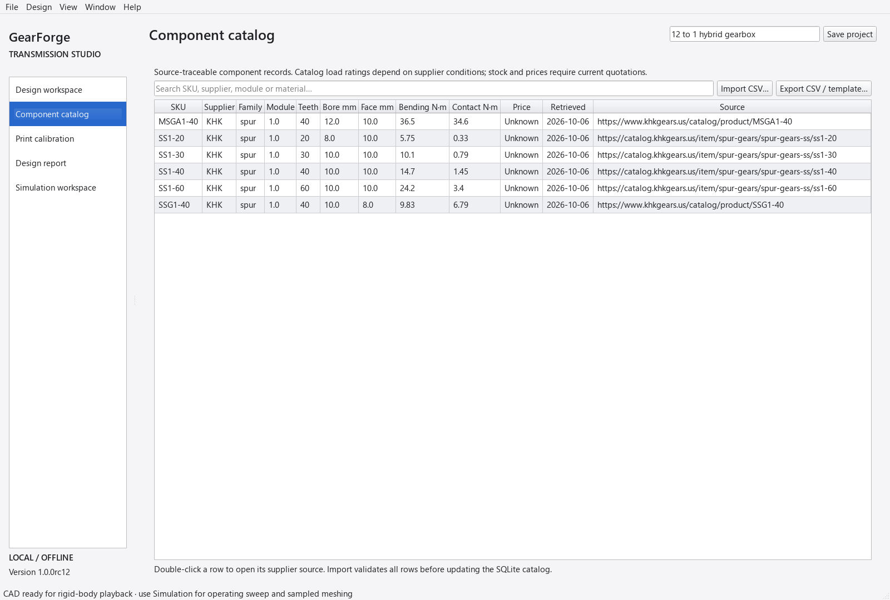

## Print calibration

Set clearances and material assumptions, export a coupon, and apply measured dimensional compensation.

[Open example](../examples/12-to-1-hybrid.gearforge) · [Read the guide](USER_GUIDE.md#print-calibration)

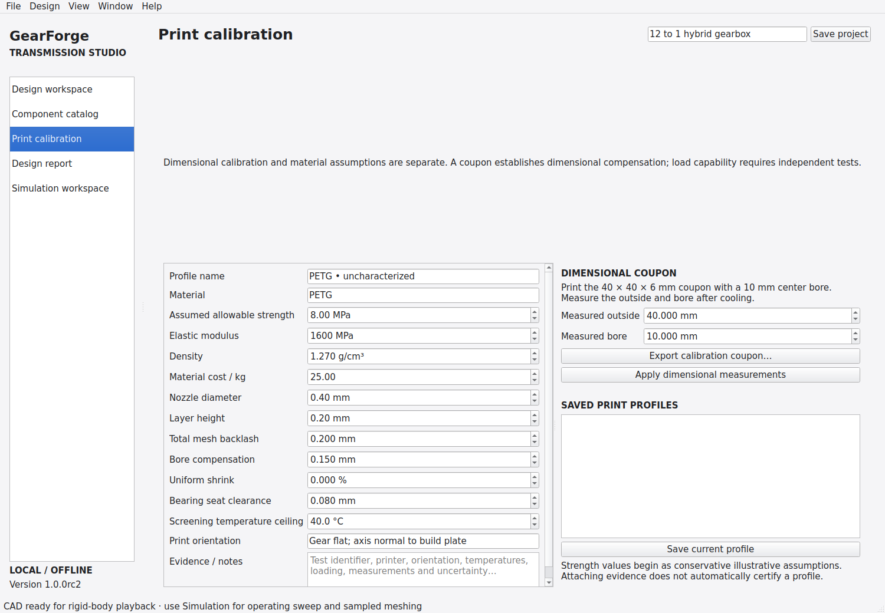

## Design report

Read the selected candidate’s calculations, bill of materials, assumptions and prototype status.

[Open example](../examples/12-to-1-hybrid.gearforge) · [Read the guide](USER_GUIDE.md#exported-files)

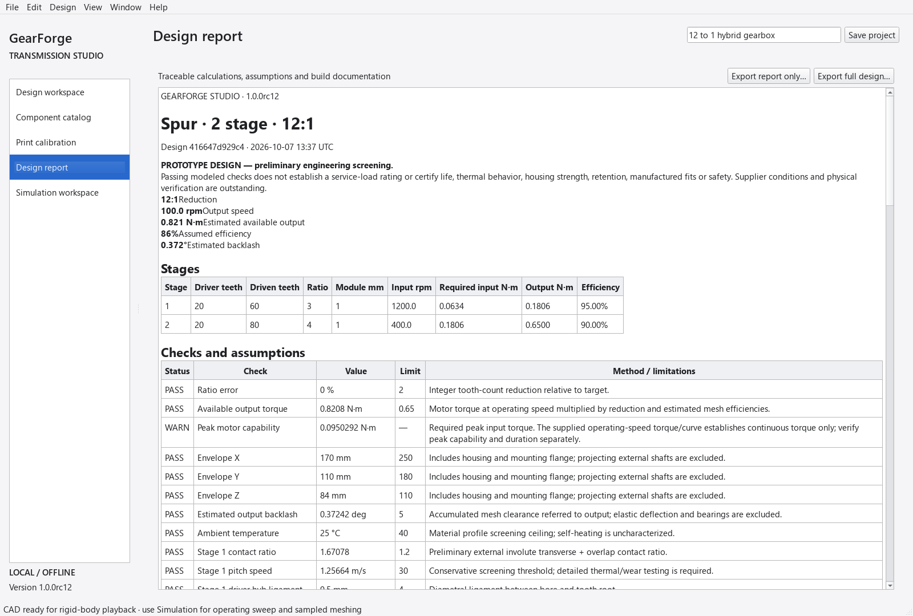

## Geometry and operating duty

Edit an external spur/helical pair, profile shifts, design targets, operating cases and source evidence.

[Open example](../examples/steel-spur-250w.gearforge-study) · [Read the guide](OPEN_ENGINEERING.md)

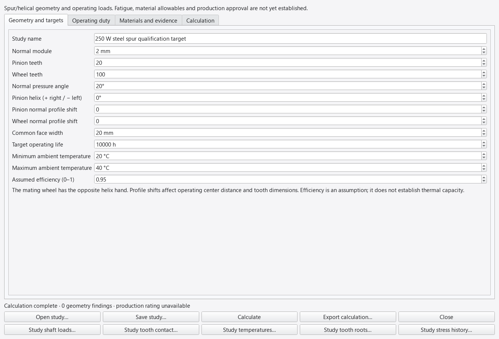

## Shaft loads and motion

Inspect the explicit shaft load path, support reactions, deflection, slope, bending, twist and nominal stress.

[Open example](../examples/steel-spur-input.gearforge-shaft) · [Read the guide](SHAFT_ANALYSIS.md)

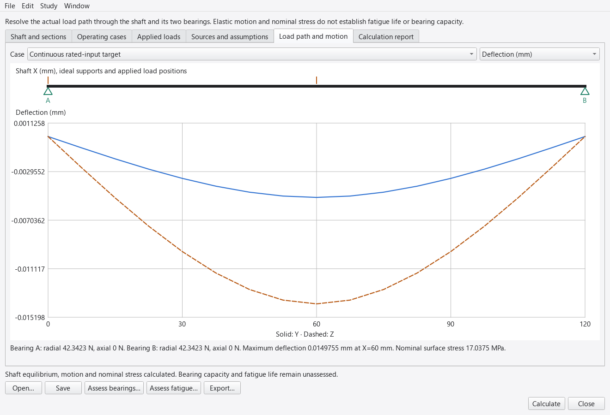

## Bearing duty and capacity

Review per-bearing basic L10 arithmetic and declared static, speed, temperature and misalignment limits. The ratings in this example are synthetic.

[Open example](../examples/steel-spur-synthetic.gearforge-bearing) · [Read the guide](BEARING_ANALYSIS.md)

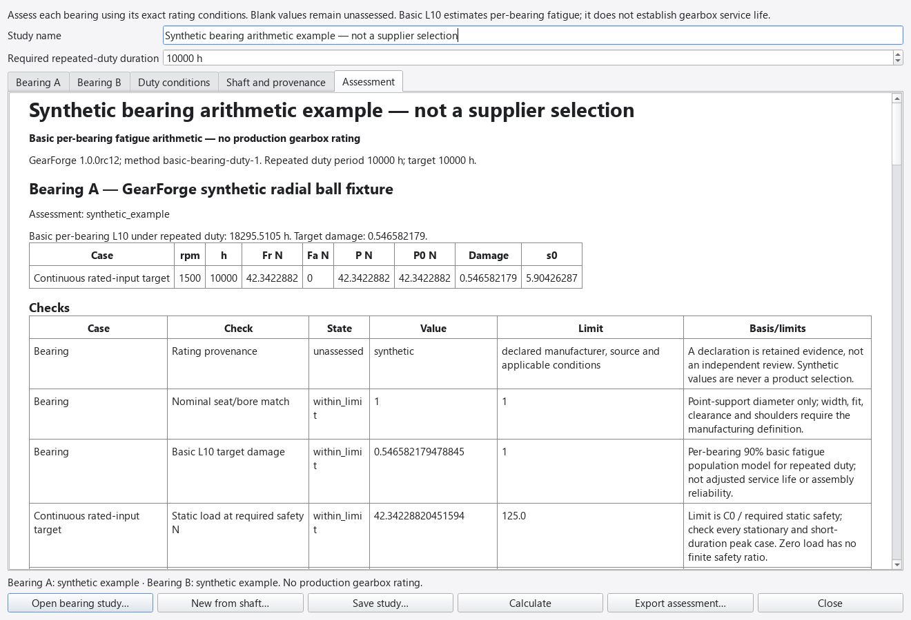

## Shaft material and fatigue

Review the public NASA worked example for a selected shaft section under rotating bending and steady torque. Benchmark inputs are not application material allowables.

[Open example](../examples/nasa-shaft-fatigue.gearforge-fatigue) · [Read the guide](SHAFT_FATIGUE.md)

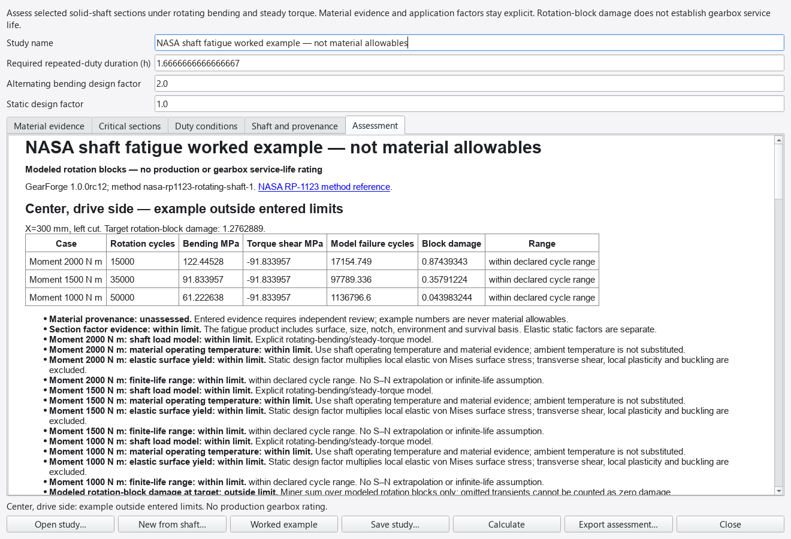

## Tooth contact and surface fatigue

Plot spur Hertz pressure and sliding along the contact path, with explicit load sharing and bounded pressure-life inputs. Material data are synthetic.

[Open example](../examples/synthetic-contact.gearforge-contact) · [Read the guide](CONTACT_ANALYSIS.md)

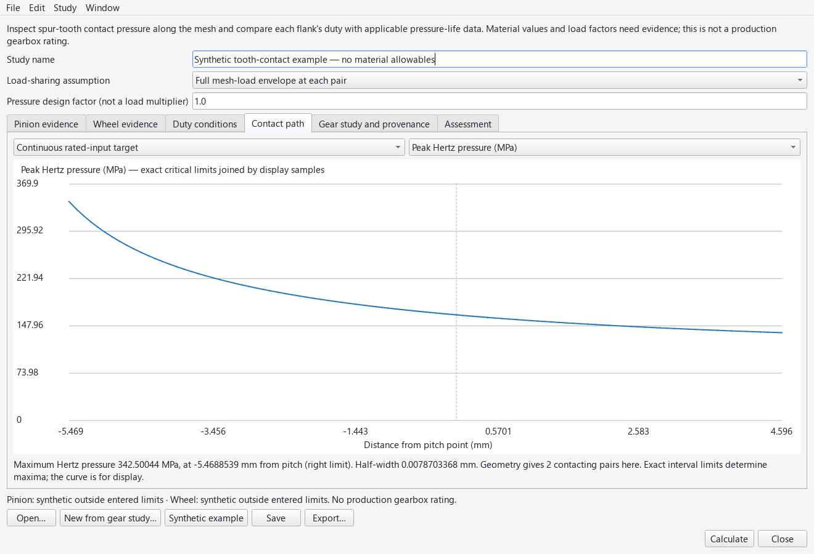

## Thermal network

Follow a selected body through an ordered heating/cooling phase; assess continuous extrema, energy balance and repeated duty. Losses and cooling data are synthetic.

[Open example](../examples/synthetic-thermal.gearforge-thermal) · [Read the guide](THERMAL_ANALYSIS.md)

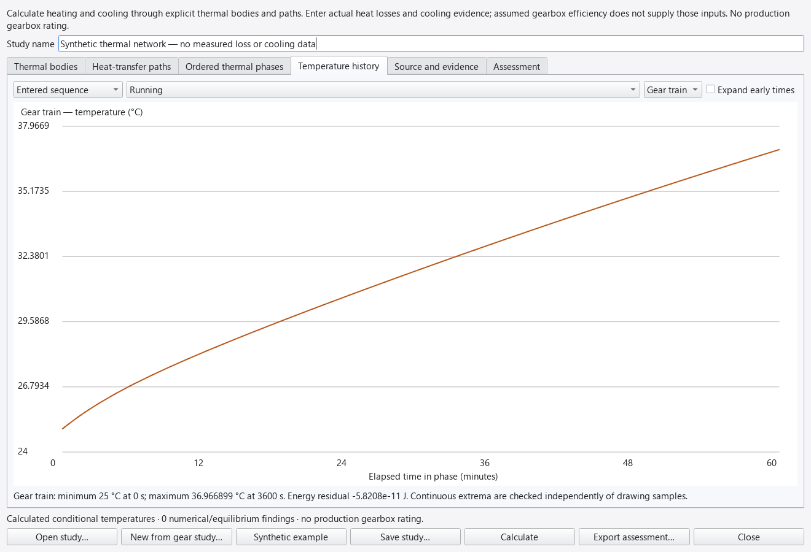

## Rack-generated tooth profile

See the generated root join the involute. The example declares a synthetic cutter; the app also checks undercut, folds and the nominal active contact path.

[Open example](../examples/synthetic-tooth.gearforge-tooth) · [Read the guide](TOOTH_PROFILES.md)

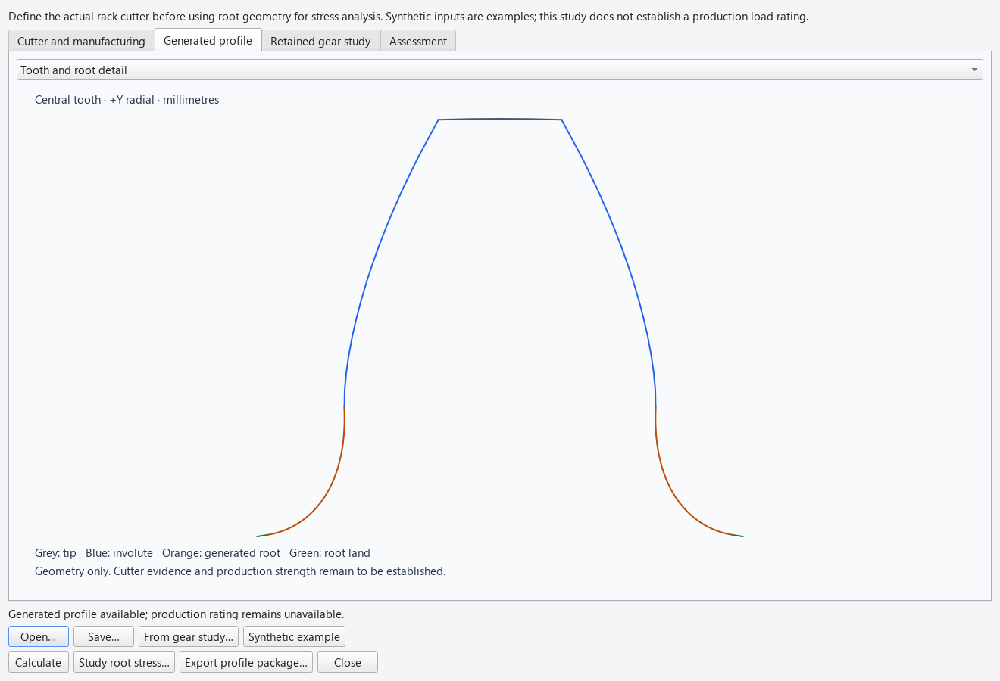

## Elastic tooth-root stress

Inspect a finite-element stress map at a sampled pressure-patch position. Three mesh levels and a wider sector support numerical comparisons; this is not a full rolling-load fatigue history.

[Open example](../examples/synthetic-root.gearforge-root) · [Read the guide](ROOT_STRESS.md)

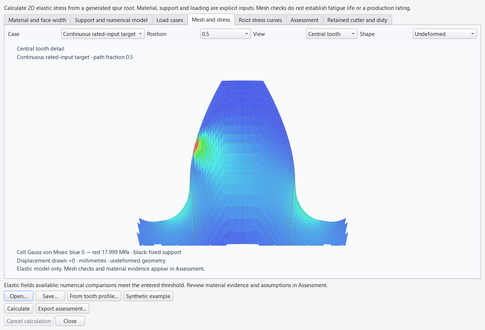

## Fixed material-point stresses

Track signed normal and shear stress at the same physical point as the sampled
pressure patch moves. Adjacent element values stay separate. The synthetic
example illustrates coordinates and directions; the trace has no time axis or
complete loading cycle.

[Open example](../examples/synthetic-root-probes.gearforge-root) · [Read the guide](ROOT_STRESS.md#fixed-material-points-and-signed-stresses)

## Signed stress history

Inspect one template block of signed local normal stress. Repeated blocks retain cross-boundary cycles; the included waveform and material curve are invented.

[Open example](../examples/synthetic-history.gearforge-history) · [Read the guide](STRESS_HISTORY.md)

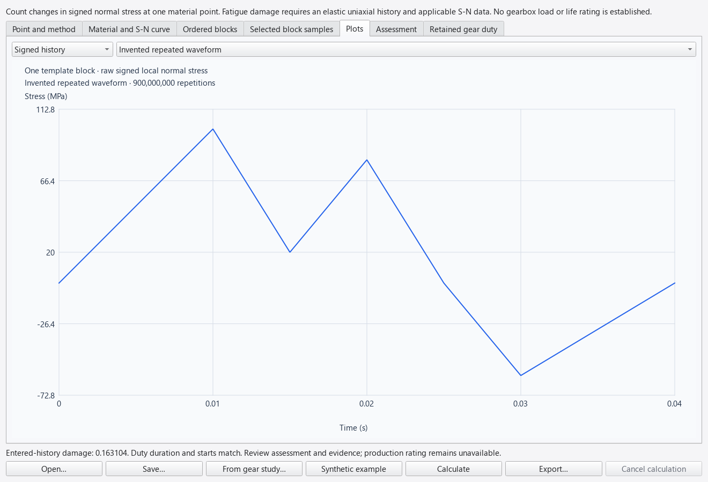

## Rainflow cycle distribution

Compare cycle ranges, means and counts from the same finite history. The complete cycle table is available in CSV; bounded damage does not establish gearbox service life.

[Open example](../examples/synthetic-history.gearforge-history) · [Read the guide](STRESS_HISTORY.md)

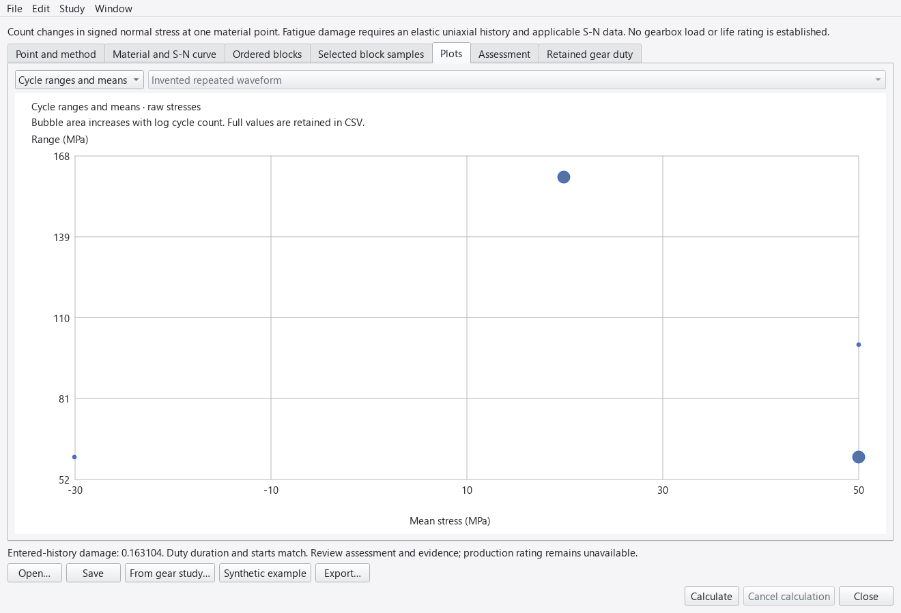

## Reproduce the gallery

Run `python scripts/capture_screenshots.py` from an installed checkout. See the [capture instructions](DEVELOPMENT.md#updating-screenshots) and [capture metadata](../screenshots/captures-all.json).
