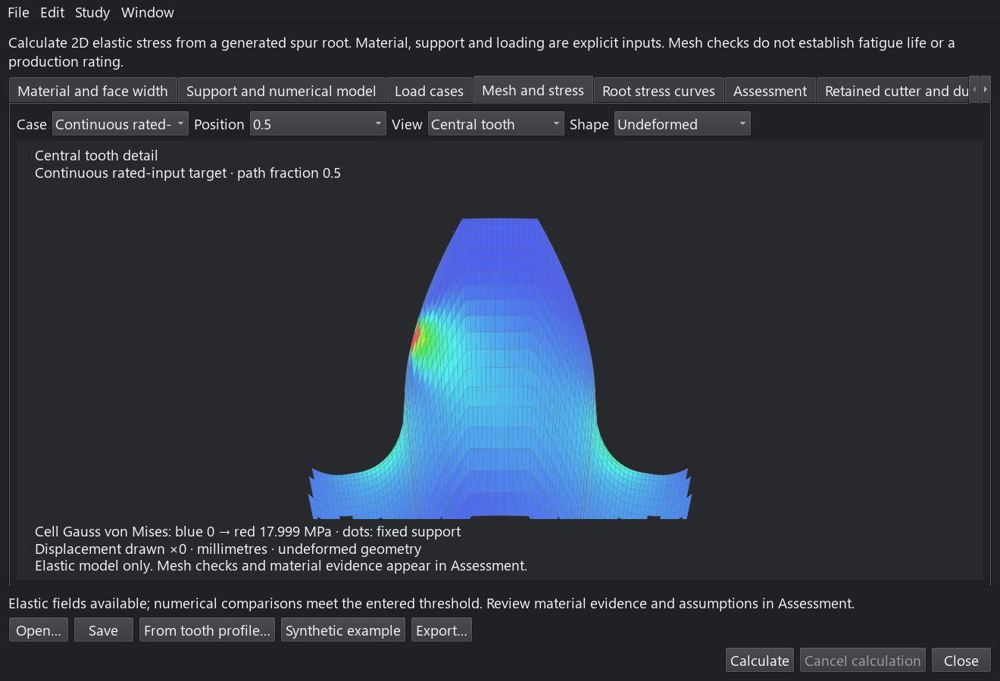
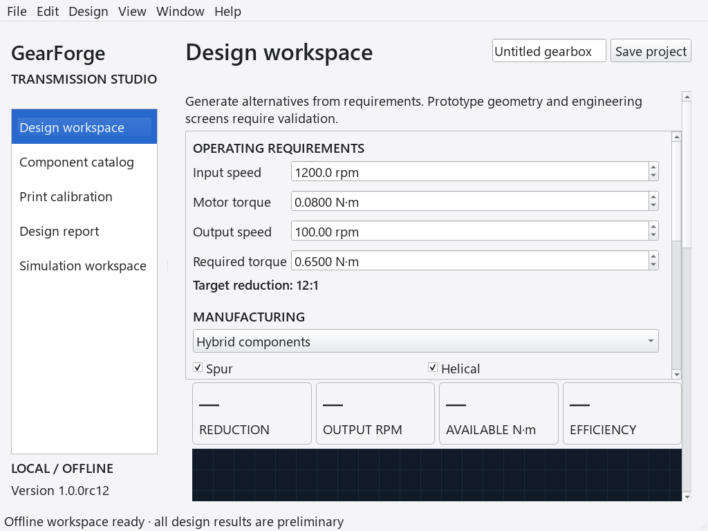

# Desktop interface audit against Apple’s Human Interface Guidelines

Reviewed October 7, 2026, on the development branch after 1.0.0rc12.
The scope covers all five main workspaces, all nine engineering editors (51
sections), Settings, advanced requirements, comparison, file operations, worker
feedback, charts and reports. Changes preserve native Qt controls and window
frames. They do not imitate Apple materials or change the calculation methods.

This is a source, behavioral and Windows Qt rendering audit. **It is not Apple
certification, a real-Mac visual review, or a VoiceOver compatibility claim.**

## Findings and changes

| Area | Finding | Change and verification |
| --- | --- | --- |
| Study workflow | Complex editors blocked the entire app and opened further modal editors. | Nine independent, resizable study windows retain the main workspace and sibling studies. Child studies belong to the main window; closing one leaves other studies available. A regression checks that an unsaved study can cancel quitting. |
| Document controls | Study Save always opened a destination picker; editors had no common shortcuts or modified-file marker. | Existing documents save in place. File menus provide Open, Save, Save As, Export and Close with standard shortcuts. Titles show filename and unsaved state; Qt receives the represented file path. All nine editors test save, cancelled Save As, successful Save As and failed saves. |
| Action hierarchy | Long button rows forced wide windows; Return could activate an unrelated button. | Secondary commands wrap; Calculate, cancellation and Close use native button-box layout. Auto-default buttons are disabled in study editors. Return in a field does not open, save or calculate; Cmd/Ctrl+Return calculates explicitly. |
| Keyboard and menus | Study commands and workspace selection lacked menu access. Catalog/profile activation relied on double-click. | File/Edit/Study/Window menus accompany study controls. Main View commands select workspaces with Cmd/Ctrl+1–5. Catalog rows and saved profiles support keyboard activation. Full-screen and minimize commands remain native. |
| Adaptable layout | Several new forms could exceed available screen height, especially at larger text sizes. | Scrollable study sections, wrapping form rows and action rows keep controls reachable. Tabs scroll without truncating their full labels. Initial study size fits the available display. The design workspace stacks requirements above results in narrow windows. Advanced requirements scroll separately from Apply/Cancel. |
| Labels and focus | Some names, form buddies, source fields and chart selectors were missing. The CAD canvas had no visible focus cue. | Shared form associations, named study sections/status/tables and explicit selectors improve Qt accessibility metadata. The keyboard-controlled CAD canvas draws a focus border and takes focus on click. Numeric reports and exports remain alternatives to custom plots. |
| Dark appearance | Tooth, root and history charts and some report text hard-coded a light surface or dark ink. | Custom chart surfaces/text use palette roles; series colors are adjusted to at least 4.5:1 against the current chart background. In-app reports follow the palette and text settings while printable exports retain their own presentation. Palette/font changes preserve report text and do not revive cleared results. |
| Color-independent meaning | Some tooth and root plots used color as the only series cue. | Tooth segments and paired root/probe curves now use named solid, dotted or dashed patterns. Existing PASS/WARN/FAIL, overload and unavailable text remain visible. A heatmap still needs its assessment/export for precise numerical interpretation. |
| Progress and recovery | New menu commands could otherwise bypass busy-state button disabling. | Study menu actions mirror the underlying worker controls, including Save As; calculation cancellation remains available. Existing edit invalidation, worker cancellation and atomic export protections are retained. |
| Motion | CAD already used explicit playback with step/seek and reduced-motion support. | Retained and regression checked. No new automatic motion, translucency or decorative animation is introduced. The macOS preference is still read at launch. |
| Reports and comparison | Dense reports used fixed CSS fonts/colors; comparison had no explicit Close action. | The in-app report renderer uses the application font and palette without changing result text or exported HTML. Comparison has a named table and native Close button. |

The changes follow Apple’s guidance on [macOS window behavior and command access](https://developer.apple.com/design/human-interface-guidelines/designing-for-macos),
[keeping modal tasks focused](https://developer.apple.com/design/human-interface-guidelines/modality),
[adaptable native windows](https://developer.apple.com/design/human-interface-guidelines/windows),
[keyboard conventions](https://developer.apple.com/design/human-interface-guidelines/keyboards),
[larger text, contrast and accessibility](https://developer.apple.com/design/human-interface-guidelines/accessibility),
and [Dark Mode](https://developer.apple.com/design/human-interface-guidelines/dark-mode).

## Reproducible evidence

- `python -m pytest tests/test_desktop_guidelines.py -q` exercises the shared
  document, layout, keyboard, color and report behaviors. Existing GUI tests also
  cover cancellation, file roundtrips and stale-result protection.
- `python scripts/audit_desktop.py` renders **224 views**: five main pages plus
  51 study sections, each at 1024 × 768 in light/dark and 100%/130% text. These
  input/empty-state images and their hashes are written to `build/gui-audit/`.
- `python scripts/capture_screenshots.py` renders **19 calculated example views**,
  including actual CAD, reports and engineering plots. The current gallery and
  [capture manifest](../screenshots/captures-all.json) contain the refreshed images.
- `python scripts/capture_screenshots.py --section studies --appearance dark
  --text-scale 1.3 --out build/gui-dark` exercises all nine editors with calculated
  example results, including fixed-point stress and both history plot views.
- [GUI_VALIDATION.json](GUI_VALIDATION.json) records the exact local verification
  results and source fingerprints. Offscreen images are not macOS screenshots.

## Appearance examples

Calculated root stress in dark appearance with 130% text:

A 1024 × 768 design workspace with 130% text stacks its panels and scrolls vertically:

## Remaining native-Mac acceptance work

A real supported Mac is required for the following checks; Qt metadata or an
image render cannot establish the result:

1. Finder launch, project double-click, document proxy paths, application menu
   merging, Cmd shortcuts, full-screen behavior and moving between displays.
2. VoiceOver reading order, editable table cells, names/values, status announcements,
   native file sheets, Full Keyboard Access and Switch Control. Custom CAD/plot
   geometry still has no individually navigable accessibility tree.
3. Live system appearance changes, Increase Contrast, display scaling and native
   focus rings. Explicit appearance overrides depend on the Qt platform plugin.
4. Reduce Motion at launch and the user-controlled playback setting. Live changes
   to the OS Reduce Motion preference are not currently observed.
5. Developer ID signing, hardened runtime, notarization, stapling and Gatekeeper
   on the exact release bundle. Those packaging checks are distinct from this audit.

The CAD viewer intentionally keeps a dark technical surface in both appearances.
Very wide data tables and plot captions can scroll horizontally; they are not
shrunk into unreadable text. The app currently uses English UI text and does not
claim localization, complete screen-reader support or full HIG conformance.

Qt platform behavior is documented in [Qt for macOS](https://doc.qt.io/qtforpython-6/overviews/qtdoc-macos-issues.html).
