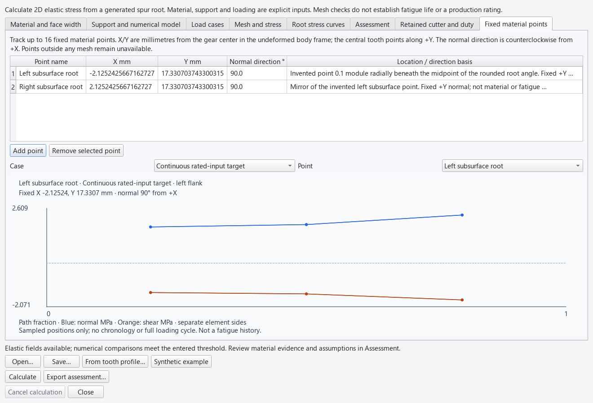

# Generated tooth-root elastic stress

Method `generated-spur-q9-elastic-3` applies an original two-dimensional linear
elastic finite-element solver to a retained [rack-generated spur profile](TOOTH_PROFILES.md).
It calculates stresses and deflections for explicit support, material and loading
assumptions. **It does not calculate tooth-root fatigue life or approve production
gearbox strength.** All code, adapters and synthetic fixtures can be published
under this repository's Apache-2.0 license. No paid standard or restricted dataset
is required. The independent reference is BSD-3-Clause scikit-fem.

## Desktop and saved studies

Open **Design → Tooth-root elastic stress…**, or **Study root stress…** in the
cutter editor to retain its current geometry, cutter and duty inputs. A fresh
study has unknown material, support radius, pressure width and load factors.
**Synthetic example** supplies invented inputs for numerical verification only.

Eight tabs contain material/temperature evidence, support and numerical controls,
per-duty load cases, mesh/stress maps, root stress curves, the assessment and
retained source inputs, plus fixed material-point stress traces. Calculate runs in a cancellable separate process. Editing
clears prior results; calculation/export failures retain the entered inputs.
Save and reopen `.gearforge-root` files without rounding numeric inputs.

The mesh map shows each cell's largest sampled Gauss-point von Mises stress.
Select a duty case and active-path position, view the whole sector or central
tooth, and optionally exaggerate displacement. The deformation multiplier is
always displayed. Root curves preserve separate values from adjacent elements;
they are not smoothed across edges. Plot extrema are sampled values.

```text
python -m gearforge root new blank.gearforge-root
python -m gearforge root new example.gearforge-root --synthetic-example
python -m gearforge root from-profile pinion.gearforge-tooth --out pinion.gearforge-root
python -m gearforge root calculate example.gearforge-root --out root-assessment
python -m gearforge verify root-assessment
```

An available calculation exports six files plus an integrity manifest, with a
seventh data file when fixed material points are requested:

- `design.gearforge-root`: editable complete inputs.
- `calculation.json`: method/version, input fingerprint, findings, all unit-torque
  field bases, actual operating-case scales, mesh checks and export selection.
- `report.html`: readable operating stresses, evidence gaps, comparisons and limits.
- `case-stresses.csv`: actual operating-case stresses, displacement and applied torque.
- `root-curves-per-unit-torque.csv`: explicitly normalized stress tensors and
  scalar measures in MPa per N mm, positions and tooth indices for every load basis.
- `mesh.vtk`: ASCII unstructured Q9 mesh (VTK cell type 28), millimetres and fixed
  supports. For the first calculable case/position, actual displacement in mm and
  cell Gauss von Mises stress in MPa are included. JSON records that selection.
- `fixed-point-stresses.csv` (optional): actual signed body-frame and resolved
  stresses, physical point coordinates, normal direction and every containing
  element side. Unavailable cases/points have explicit status and blank stress
  cells, never fabricated zeros. Path fraction is not elapsed time.

An unsupported calculation exports inputs/JSON/report only. An available mesh
with no calculable operating case exports geometry without fabricated stress
fields. Exports use a new directory and staged rename. The fingerprint identifies
inputs; it is not a reviewer signature. Every result leaves production approval
false and rated torque/gearbox life unavailable.

## Geometry, boundaries and loads

The domain contains an odd number of teeth centered on +Y. Its outer boundary is
sampled directly from the analytic cutter envelope and involute. The inner arc
has both displacements fixed; radial cut faces are traction-free. The declared
support radius must leave at least 0.1 module of material below the generated root.
This is a truncated sector model, not a full hub, keyway, shaft or press-fit model.

Mesh columns include tip, involute/root joins, root lands and patch endpoints.
Intervals between those anchors are subdivided to avoid arbitrarily narrow cells.
Radial layers concentrate toward the outer boundary. Q9 displacement nodes use
shared straight-edge midpoints and bilinear cell centers; geometry remains a
piecewise-straight representation, not an exact curved finite element.

Load positions are explicit increasing fractions of the retained ideal active
line-of-action interval. They sample engagement; they do not locate its continuous
worst load position. Each patch is centered at an involute arc length
`L=(r²-rb²)/(2rb)` and has declared half-length `h`. Normal pressure varies as
`max(0, 1-((L-Lcenter)/h)²)` along the polygonal flank and uses inward analytic
involute normals. Four-point boundary quadrature creates consistent Q9 edge loads.
Their resultant is normalized to exactly ±1 N mm about the gear center.
Patches crossing the involute start or tooth tip are rejected.

The applied member torque magnitude is the retained input torque times the ideal
gear ratio for a wheel, times the entered load multiplier and share. Each factor
needs a basis. Both members use a right-handed X/Y body frame, with positive
torque counterclockwise. Positive retained pinion input torque selects the **left
flank on both members**; negative input selects the right. Mesh torque opposes
the pinion drive and drives the oppositely rotating wheel, so both mesh torques
have the opposite sign to the pinion input. Reports and case CSVs retain the
signed mesh torque and member speed as well as the torque magnitude. This does not solve load sharing, gear contact,
dynamics, face misalignment or an elastic mating gear. The pressure patch is an
assumption, not a Hertz/contact solution. Width is the entered effective face
width, bounded by the retained member's physical face width.

## Elastic solver and numerical checks

`bilinear-geometry-q4-q9-plane-1` uses mm, N and MPa, engineering strains
`[epsilon_x, epsilon_y, gamma_xy]`, homogeneous isotropic stiffness and small
strain/displacement. Plane stress uses `sigma_z=0`; plane strain includes the
out-of-plane stress in three-dimensional von Mises and principal measures.
Poisson ratio is limited to 0–0.49 for plane stress and 0–0.45 for plane strain;
near-incompressible behavior is outside this displacement formulation's scope.

Original shape functions, coordinate transformations, strain matrices, stiffness
assembly, load integration and stress recovery are implemented in the app.
SciPy supplies sparse assembly/factorization. Q4 uses full 2×2 integration;
Q9 uses full 3×3 integration. There is no reduced integration or hourglass factor.
The determinant of a bilinear map is affine in natural coordinates; positive
corner determinants check positivity throughout the cell. Distortion and
conditioning limits, finite values, unique connectivity, rigid-body support
restraint on every connected component, equation residual and force/moment
equilibrium are checked before results are accepted.

Root stresses are recovered at five positions on each outer fillet edge, retaining
both element-side values at shared nodes. Reported tensile stress is the maximum
nonnegative principal value including `sigma_z`. Reported von Mises stress uses
all three normal components and in-plane shear. Neither the five edge samples nor
the nine cell Gauss samples certify a continuous stress maximum.

Three meshes use base divisions/layers multiplied by 1, 2 and 4. Relative change
is `100 abs(b-a)/max(abs(b),1e-30)` for root von Mises, root tensile stress and
compliance (`2*strain energy` under unit torque). The final change must meet the
entered threshold and decrease from the preceding change, at every sampled
position/flank. Both changes are reported. A fine mesh with two extra teeth checks
cut-face proximity at the same support radius. Failure/unavailability stays visible;
a missing wider-domain result does not erase available base-model fields.

These comparisons are sensitivity checks, not certified discretization-error
bounds or proof of physical validity. Load/support singularities may remain.
Limits are 40,000 elements, 90,000 nodes and 750,000 stored node/load combinations.
Reduce resolution, domain size or load samples if those bounded resources are
exceeded; doing so does not waive unresolved convergence.

## Fixed material points and signed stresses

The **Fixed material points** tab accepts up to 16 named points with physical
X/Y coordinates in millimetres and an in-plane normal direction in degrees
counterclockwise from +X. Coordinates are measured from the gear center in the
undeformed body frame; the central tooth points along +Y. Enter the basis for
the location and direction. The [synthetic point study](../examples/synthetic-root-probes.gearforge-root)
places two mirrored points beneath a generated fillet to demonstrate the workflow.
Those coordinates are invented, not validated critical fatigue locations.



The solver inverts each candidate element's bilinear geometry at the same
physical point on all three meshes and the wider sector. It recovers the signed
tensor `[sigma_x, sigma_y, tau_xy, sigma_z]` through that element's displacement
derivatives. Points on shared boundaries retain **every containing element-side
value**, without smoothing. Points outside a polygonal mesh remain unavailable;
there is no nearest-node substitution. Mapping residuals and natural coordinates
are retained in the calculation JSON.

For `n=(cos(theta), sin(theta))` and `m=(-sin(theta), cos(theta))`, the signed
normal stress is `n.T sigma n`, shear is `m.T sigma n`, and transverse stress is
`m.T sigma m`; out-of-plane stress is retained separately. Positive normal stress
means tension. The direction stays fixed as loads move or reverse. These are
ordinary stress-tensor transformations; see the openly accessible
[MIT stress notes](https://web.mit.edu/16.20/homepage/1_Stress/Stress_files/module_1_no_solutions.pdf).

The plot shows signed normal and shear stress against sampled path fraction,
with separate traces for each element side. The report and CSV include all four
resolved components. Each point receives its own mesh and sector comparisons:
at matching load positions/flanks, compare the lower and upper element-side
bounds of each resolved component. The reported percentage is 100 times the
largest bound change divided by the largest absolute resolved component across
the complete finer trace (floor `1e-30`). The final refinement must meet the
entered tolerance and improve on the earlier change. Missing values remain
unassessed; overall case numerical checks cannot pass with an unresolved point.
These envelope checks do not certify individual-side convergence or error bounds.

**A load-position trace is not a complete fatigue history.** This study does not
assign times, include the unloaded part of a revolution, solve tooth-pair load
sharing or prove uniaxial applicability. It does not transfer these samples into
the cyclic-history calculation. Joining moving root maxima would follow different
material points and lose stress signs. Fixed probes avoid that particular error;
real loading cycles and qualified fatigue evidence still require further work.

Existing `.gearforge-root` files without points open with an empty point list.
Method revision 2 adds the optional inputs and outputs; revision 1 validation
records remain historical evidence for that earlier implementation.

Revision 3 corrects the driven-wheel sign convention: earlier revisions selected
the opposite wheel flank despite retaining a negative external-wheel speed.
Symmetric peak magnitudes were unchanged, but the loaded side and fixed-point
signed stresses could differ. **Recalculate wheel studies created with revisions
1 or 2 before interpreting their stress fields.** A mating-surface kinematics
check verifies coincident contact points, opposite normals, and signed moments
for both directions through complete pinion/wheel revolutions.

## Material evidence and scope

Young modulus, Poisson ratio, elastic stress limit, temperature interval, source
revision and redistribution basis are user inputs. Missing load factors prevent
operating-case stresses. A temperature outside the declared range prevents that
case's stress assessment. Missing temperature coverage is explicitly unassessed;
numeric stress can still be shown with incomplete evidence. A synthetic example
never becomes material evidence because its numerical checks pass.
The declared-input completeness flag also requires declared cutter data and its
source/redistribution basis. It records entered evidence, not independent review.

Comparisons with an entered elastic limit are arithmetic only. The model has no
plasticity, residual stress, heat-treatment gradient, anisotropy, 3D face effects,
fatigue, surface integrity or manufacturing variation. Production qualification
still needs applicable material/process data, realistic support and loading,
independent engineering review, tolerance/assembly checks and physical evidence.
The earlier prototype CAD outline remains a separate approximation.

## Independent open-source verification

[scikit-fem](https://github.com/kinnala/scikit-fem), version 12.0.2,
[BSD-3-Clause](https://github.com/kinnala/scikit-fem/blob/12.0.2/LICENSE), assembles
its own basis and linear-elastic weak form in a separate process. The adapter
passes only original meshes, loads, constraints and material numbers; it does not
import GearForge's shape derivatives, stiffness matrix or stress recovery.
Physical node matching establishes the reference vector ordering explicitly.

Six original fixtures cover Q4/Q9 uniform traction, plane stress/strain, a
distorted quadratic bending patch and generated roots with zero/positive shift
and opposite flanks. The 4,582 comparisons include every nodal displacement,
constrained reaction, per-element mean of Gauss stress samples and strain energy.
That mean is not a volume-weighted average. Relative tolerance is `2e-8`;
absolute tolerances are `2e-11 mm`, `2e-7 N`, `2e-7 MPa` and `2e-10 N mm`.
The stored explicit meshes permit regression replay independent of adaptive
mesh construction differences across platforms.

```text
python -m venv reference-env
reference-env/Scripts/python -m pip install -r scripts/requirements-elastic-reference.txt
python scripts/verify_elastic_reference.py --reference-python reference-env/Scripts/python
```

On Unix use `reference-env/bin/python`. scikit-fem is confined to the reference
environment; no reference implementation or documentation is bundled. Its own
license is retained by its installation. Original fixture numbers and adapter
code are Apache-2.0. Analytic uniform-traction/affine/quadratic patch tests,
equilibrium, symmetry, scaling, unsupported inputs, mesh/domain sensitivity,
VTK import, file integrity and desktop worker behavior supplement the comparison.
Numerical agreement does not validate actual gear fatigue or service life.

The fixed-point extension adds **6,400 signed stress-component comparisons**
against a separate scikit-fem 12.0.2 process. The same six original meshes cover
Q4/Q9, plane stress/strain, a distorted bending patch and two generated roots.
Five points per cell cover interior, shared-edge and vertex locations. The
reference inverts its own mapping and differentiates its own basis at the
physical coordinates; no application natural coordinates or stress recovery
enter that process. Relative tolerance is `2e-8`, absolute tolerance `2e-7 MPa`.
The retained fixture links each case to its original mesh/load hash. Analytic
tensor rotation, discontinuous edge stresses, reversal, missing points and
desktop/export checks supplement this comparison.
The [development validation record](STRESS_PROBE_VALIDATION.json) retains tested
source hashes, local test counts, reference tolerances and the example's checks.

```text
python scripts/verify_stress_probe_reference.py --reference-python reference-env/Scripts/python
```
